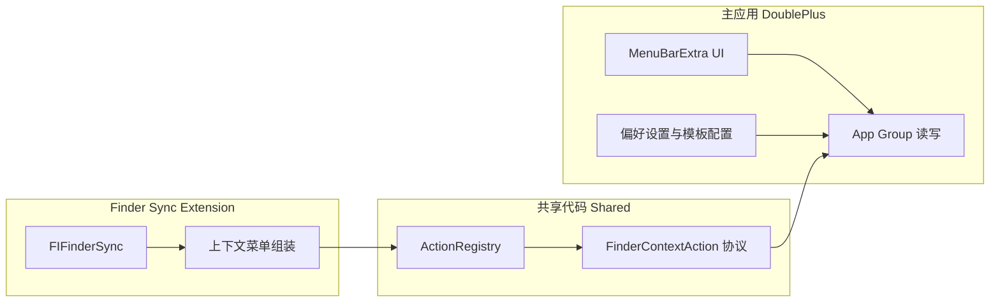

# DoublePlus：菜单栏 + Finder 右键新建（设计与实施计划）

## 现状

- 工程：[DoublePlus.xcodeproj](DoublePlus.xcodeproj) 为单 Target 应用，入口为 [DoublePlus/DoublePlusApp.swift](DoublePlus/DoublePlusApp.swift) 的 `WindowGroup` + [DoublePlus/ContentView.swift](DoublePlus/ContentView.swift)。
- 已开启 **App Sandbox**、**REGISTER_APP_GROUPS**（需在实现阶段补全 **App Group ID** 与 entitlements，供主程序与扩展共享配置/模板）。

## 平台能力与方案选择（为何不是「主程序里写右键」）

| 需求             | 说明                                                                                                                                |
| -------------- | --------------------------------------------------------------------------------------------------------------------------------- |
| Dock 隐藏、仅菜单栏   | 使用 `MenuBarExtra` 作为唯一 `Scene`，并在 Info 中设置 **Application is agent (UIElement)**（`LSUIElement` = YES），避免 Dock 与 Cmd+Tab 中出现常规应用图标。 |
| Finder 内「右键新建」 | 必须由 **Finder Sync Extension**（`FIFinderSync`）在 Finder 进程侧注入菜单；主应用无法直接改写 Finder 右键菜单。                                              |
| 后期「右键分享」       | 同样适合放在 Finder Sync 的 `NSMenu` 中（例如对选中文件调用 `NSSharingService`），与「新建」共用同一套扩展点与动作抽象。                                                 |

**用户侧注意**：首次使用需在「系统设置 → 隐私与安全性 → 扩展 → 添加的扩展 → Finder」中启用本应用的 Finder 扩展（具体文案以系统版本为准）。

## 架构（可扩展）

- **共享层（建议 `DoublePlus/Shared/` 或独立小 Framework Target，两 Target 均编译同一组文件）**
  - 定义 `FinderContextAction`（或等价命名）：`id`、`本地化标题`、适用的 `FIMenuKind`（如空白处/选中项）、`validate(context:) -> Bool`、`perform(context:)`。
  - `ActionRegistry`：启动时注册内置动作（新建文件夹、新建文本文件等）；后续「分享」实现为另一个 `FinderContextAction`，内部调用 `NSSharingService` 等，无需改菜单组装逻辑，只需注册。
  - **文件落地**：在 `perform` 中使用扩展回调里提供的 **目标目录/选中 URL**（通过 `FIFinderSyncController` 当前 API 获取，实现时以 Apple 文档为准），用 `FileManager` 创建文件/目录；失败时通过 `NSAlert` 或 os_log 提示。
- **主应用**
  - 移除或不再使用主导航式 `WindowGroup`（若需设置窗口，可用 `MenuBarExtra` 内 `Settings` scene 或弹出 `Window`/`NSPanel`，避免默认出现 Dock 图标）。
  - 菜单栏：使用 `MenuBarExtra`，下拉内容包含：关于/退出、（可选）模板管理入口、扩展未启用时的引导文案。
- **Finder Sync Extension（新 Target）**
  - 实现 `FIFinderSync`：在 `menu(for:createBeforeItems:)` 中根据 `FIMenuKind` 返回带子菜单的 `NSMenu`（例如「DoublePlus」→「新建文本文件」「新建文件夹」）。
  - 菜单项 action 调用共享层 `ActionRegistry` 中对应 `perform`。

## 与 Windows「新建」的差异（写入使用文档）

- Finder 已有系统级「新建文件夹」；本应用可提供 **额外模板**（如 `.txt`、`.md`）和统一品牌子菜单，避免与系统菜单完全重复时可只做「新建文件」类能力。
- 命名冲突时建议自动追加序号（如 `未命名 2.txt`），并在设计文档中写明。

## 配置项清单（实现阶段）

1. **Info.plist / Target 设置**
  - 主应用：`LSUIElement` = YES；若使用自动 Info.plist，通过 Build Settings 的 `INFOPLIST_KEY_LSUIElement` 或自定义 Info 键注入。
  - 扩展：`NSExtension` / `NSExtensionPointIdentifier` = `com.apple.FinderSync`（由 Xcode 模板生成，需核对）。
2. **Entitlements**
  - 主应用与扩展：同一 **App Group**（例如 `group.Ncc.DoublePlus`，与 [project.pbxproj](DoublePlus.xcodeproj/project.pbxproj) 中 `PRODUCT_BUNDLE_IDENTIFIER` 命名空间一致）。
  - Sandbox 保持开启；扩展侧文件访问以 Finder 提供的 URL 为准（实现时对照当年 Xcode 模板与 Apple 文档补全必要 entitlement）。
3. **Xcode 工程**
  - 在 Xcode 中 **File → New → Target → Finder Sync Extension**，将共享 Swift 文件同时加入主应用 Target 与 Extension Target 的 **Target Membership**（或采用内嵌 Framework 方案）。

## 菜单栏图标（占位与如何更换）

- **第一阶段（占位）**：在 `MenuBarExtra` 上使用 **SF Symbol**（例如 `doc.badge.plus` 或 `folder.badge.plus`），无需准备位图即可运行。
- **后续改为自定义图**：
  1. 在 [DoublePlus/Assets.xcassets](DoublePlus/Assets.xcassets) 中新增 **Image Set**（建议命名如 `MenuBarIcon`），勾选 **Render As: Template**，提供 1x/2x 单色或清晰剪影（菜单栏通常为 18pt 左右，提供 @2x 即可）。
  2. 将 `MenuBarExtra` 初始化从 `systemImage:` 改为使用 `Image("MenuBarIcon")` 或 `Label` + `Image`。
  3. **说明**：菜单栏图标与 **AppIcon**（[AppIcon.appiconset](DoublePlus/Assets.xcassets/AppIcon.appiconset/Contents.json)）是两套资源；Dock 隐藏后用户几乎看不到 AppIcon，但安装器/关于本机仍可能用到，可按需再补全各尺寸 PNG。

## 文档交付（中文，与代码同库）

实现完成后新增（或按你指定路径）：

- `**docs/设计说明.md`**：目标与范围、模块划分、Finder Sync 与主程序职责、动作协议与注册表、App Group 数据、错误处理与命名策略、后续扩展点（分享、更多模板）。
- `**docs/使用说明.md`**：安装与首次启用 Finder 扩展、菜单栏操作、在 Finder 中如何调出「新建」、常见问题（扩展未出现、Sandbox 限制、权限）。

（你已明确要求文档；这与「默认不写无关 markdown」的惯例不冲突。）

## 风险与验证

- **签名与团队**：当前 [project.pbxproj](DoublePlus.xcodeproj/project.pbxproj) 已配置 `DEVELOPMENT_TEAM`；扩展需同一 Team 签名，用户机器上才能加载。
- **验证步骤**：本地 Run 主 Target → 启用扩展 → 在 Finder 窗口空白处右键确认菜单；菜单栏图标与无 Dock 行为目检。

## 建议实施顺序

1. 主应用改为 `MenuBarExtra` + `LSUIElement`，下拉基础菜单与退出。
2. 添加 App Group 与共享 `FinderContextAction` + `ActionRegistry` + 最小实现（新建文件夹、新建 `.txt`）。
3. 新建 Finder Sync Target，接 `FIFinderSync`，把菜单接到注册表。
4. 撰写 `docs/设计说明.md`、`docs/使用说明.md`，并写入图标替换说明。

